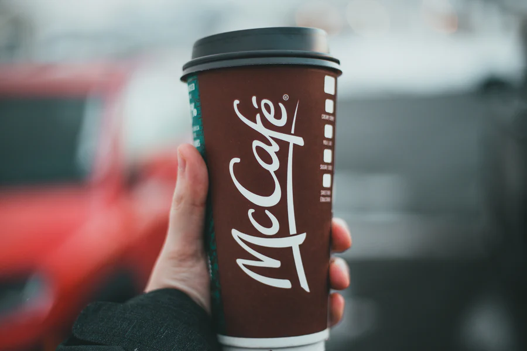

McDonald’s. The largest and most well-known chain of hamburger fast food restaurant in the world. But how did it become so successful?

Along with McDonald’s famous cheap fast food that is wildly popular around the world, the typography the company uses and how it has evolved over the years is a contributing factor to McDonald’s great success. McDonald’s “M” logo was designed by Jim Schindler in 1962, 22 years after it had been founded in San Bernardino, California. These golden arches soon became a symbol of McDonald’s and is one of the most iconic logos in the world.

As well as the famous golden arches, McDonald’s also used a clever colour scheme to represent the fast-food chain. The contrast that the yellow and red create makes the logo and typography of the McDonald’s design tremendously striking and eye-catching and certainly memorable. The yellow in the logo attracts attention due to the brightness of it, as well as this the colour yellow also conveys connotations of softness which also creates a sense of warmth. This could be because the colour yellow is generally associated with the sun, which indicates that it is a particularly inviting colour that evokes a feeling of positivity. By adding red to the mix, not only does it make the yellow “M” stand out even more, but it also draws a lot of attention to itself, encouraging people to go eat there. Red is stimulating and exciting, some psychologists would even go as far as saying that the colour red stimulates appetite. This analysis of colour is an indication of how significant colour can be and I think that it is a huge factor in how successful McDonald’s has become over the years.

The typography that McDonald’s uses is simple but effective. On their website they use the typeface Lovin’ Sans, which contains bold letters with Sans Serif corners. The weight of the letters is quite heavy, with most of the headings and sub-headings in capital letters. This contributes to the eye-catching, yet simple approach McDonald’s is trying to achieve. The typography that McDonald's typically has a low contrast, therefore aligning with their theme of simplicity, however the McCafe font is different - with a higher contast then the other fonts they use. The italic font they use gives this part of McDonald's more sophisicated connotations, maybe they have done this in order to appeal to adults, and show that there is a part of their company that should be taken seriously. 

Overall, McDonald's typography is very successful in promoting their food and drinks. But is this manipulative use of colour and typography to promote predominantly unhealthy food really a good idea? 

