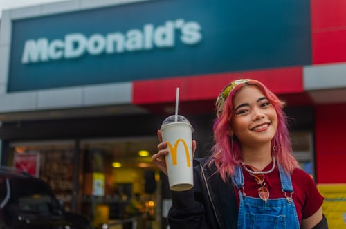
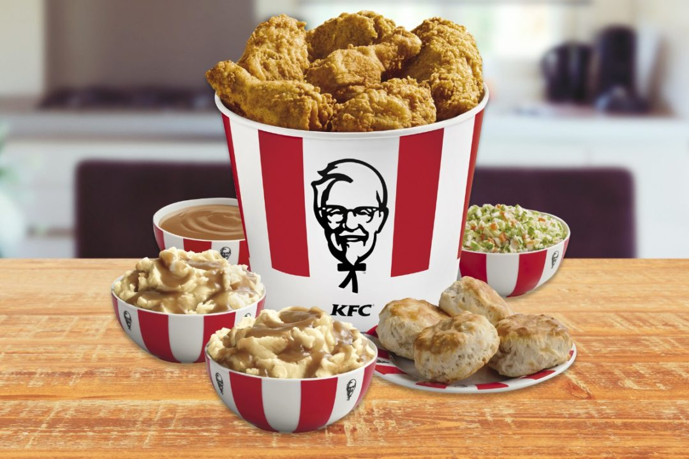

One of the biggest target audiences that fast food restaurants aim to attract are children. But what tips and tricks do they use to grab young people’s attention?

McDonald’s famous ‘Happy Meal’ is a great example of how to advertise food to children. The typography, colour scheme and general design that McDonald’s have used for the ‘Happy Meal’ is a clear indication as to why McDonald’s is so popular amongst children. The design tneds to change a lot depending on what is currently in cinema or the time of year, but there are always similarities to the one before. The ‘Happy Meal’ logo is bright and cheerful, lots of colours are used to create some sort of rainbow effect. As well as this the a yellow smile like symbol is also associated with the ‘Happy Meal’ it is the same font as the famous golden arches that the main part of McDonald’s uses. The imagery can vary from famous cartoon characters displayed on the box to children games - a clever adverisement strategy. As well as this the typography used is simple and large, therefore easy for children to read and understand. Although this use of design certainly is particularly attractive to children, for parents however, this promotion of unhealthy food is irritating.

McDonald’s have received a lot of backlash over the years over the negative impacts that their food has on the health of young people. This poses the questions – should fast food chains such as McDonald’s really use such attention grabbing and somewhat manipulative typography and design? Does the design that McDonald's use really correlate with its popularity and success? 

Top tips for designing products for children –

<!--\\[if !supportLists]-->-        <!--\\[endif]-->Language – simple, easy to understand words and lettering used.

<!--\\[if !supportLists]-->-        <!--\\[endif]-->Typography – large, bold font with a low contrast, a heavy weight and capital letters

<!--\\[if !supportLists]-->-        <!--\\[endif]-->Colour Scheme – a collection of bright colours that are eye-catching and stand out

<!--\\[if !supportLists]-->-        <!--\\[endif]-->Design – use of imagery, for example use of popular cartoon characters

<!--\\[if !supportLists]-->-        <!--\\[endif]-->Deals – bold advertisement of free things/deals, for example free toys that happy meals provide

KFC use their typography and design to advertise their family share boxes – KFC are hot on the best deals and use their typography and design to attract families. They highlight these deals by using circular stickers on the side of images of KFC family buckets. In these circular stickers they have the cheap prices in bold lettering, not only do the prices grab your attention but the type of bog-standard typography they use makes it easy to read. For families this is key and as the typography is so simple, it makes you feel as if getting a family bucket would be a stress free and cheap dinner option.

<!--EndFragment-->