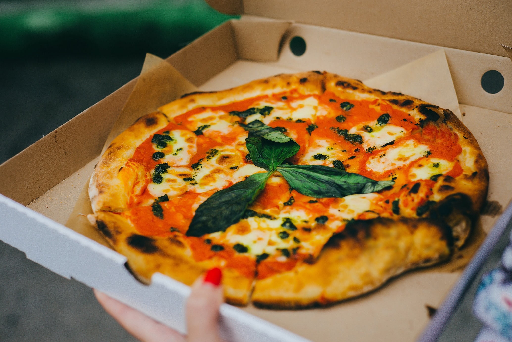

Dominoes and Pizza Express use design and typography very differently even though they make very similar products. Which design strategy is better?

Dominoes is predominantly a takeaway service, specialising in pizza, but their menu can also include garlic bread, potato wedges and cookies. Their colour scheme is bright blue, bright red and white and it very bold and eye-catching. The font they use is very simple and basic, with most of the words being in capital letters apart from the logo. The lettering is heavy in weight, with a low contrast and a regular width. They are following the same ideas as most fast-food chains, like McDonald’s, by adopting a big, over the top design which makes their product more attractive to their target audience. The Dominoes logo is very well-known across the world, the red and blue image of a domino is iconic. Dominoes also uses the same design of the logo on their pizza boxes a clever method of advertisement, it continues to get the Dominoes logo out there for everyone to see.

Dominoes is a multinational pizza restaurant chain that was initially founded in 1960, it is extremely popular all over the world, with stores in 83 different countries. However, it wasn’t until 2012 that the design and typography that Dominoes use was the same as it is today. I think that since they adapted the typography used, including the design of the logo and the colour scheme it has really helped advertise Dominoes to all audiences.

Pizza Express, on the other hand, takes a very different approach, in terms of design, to Dominoes, even though both chains make the same product. Pizza Express is predominantly a restaurant and have only recently started appearing on takeaway services such as Deliveroo. The typography that’s used is relatively light in weight, has a high contrast and regular in width. The letters have curved shapes making the wording more inviting and relaxed. I think the smooth and shapely lettering provides more sophisticated connotations than Dominoes’ typography. The logo is a black and white, circular design with ‘Pizza Express’ written at centre and a swirly design surrounding it. I think the logo is quite fancy and the simplicity of the black and white reiterates their objective in creating a classy enterprise.

Dominoes aim is clearly to appeal to the masses, whereas Pizza Express’ design is more prestigious therefore promoting to their target audience that their restaurant is a nice, distinguished place to eat. Overall, I think neither pizza chain is better than the other, they both fulfill their aims through their design and market successfully to the audiences they aim to attract.

 

