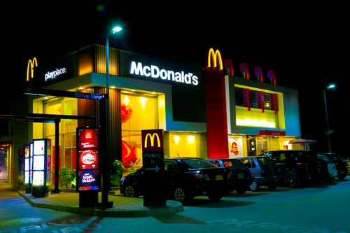

McDonald’s wasn’t always designed like it is today, the typography used was initially very basic, black, and white and quite frankly, boring. It wasn’t until 1960 that the famous ‘golden arches’ first appeared which sparked the beginning of McDonald’s success.

From 1940-1948 the McDonald’s logo was just text that said “McDonald’s Famous Barbeque” with the typography being different in each word. The word ‘McDonald’s’ was written in italics, the ‘Famous’ in capital letters with two elongated, horizontal lines coming out of either end and the ‘barbeque’ also in capitals and larger than the other two words. This logo suggests that the designers could have been inexperienced when designing this logo, as it is dull, colourless and the contrast of the typography used for each word looks awkward and odd. From 1948-1960 the logo changed twice, and an illustration of a McDonald’s character was even introduced, but the logos seem unprofessional and lack anything unique or engaging. The first appearance of the ‘golden arches’ was in 1960, however it differs slightly from the current ‘golden arches’ we see advertised everywhere today. In the 1960-1968 version of the McDonald’s logo, the ‘golden arches’ slightly cross over and there is also a yellow line that crosses over it diagonally. As well as this ‘McDonald’s’ is also written underneath it in red and yellow, and there is a blue circle surrounding this whole design. Since 1960 the McDonald’s logo has only been slightly adapted every couple of years, the introduction of the reds and yellows that we all commonly associate with McDonald’s began making a notable entrance in 1983. As well as this the iconic slogan ‘I’m lovin’ it’ appeared in the 2003 logo briefly, until it just became the ‘golden arches’ standing alone by 2006 and hasn’t changed since.

The ‘golden arches’ also looks like an m for McDonald’s, but it is said that there are also other things that inspired the design of the logo. It is said that the ‘golden arches’ evoke sexual connotations, as the rounded m is said to symbolise a pair of breasts. The design consultant and psychologist Louis Cheskin in 1960 actively persuaded McDonald’s to use the ‘golden arches’ as their logo, from a psychological point of view he thought it would seduce the public into buying by manipulating their unconscious desires. McDonald’s is a successful billion-pound company, so Louis Cheskin’s prediction was clearly correct!

